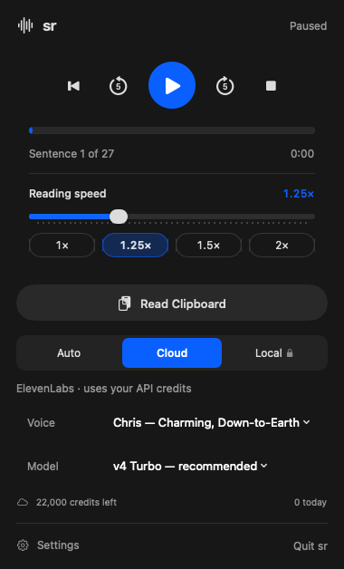
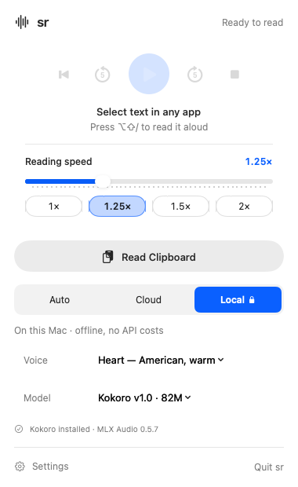

# SR reader UI review — September 28, 2026

Scope: the native menu-bar reader and its Settings window. Baseline: the user's supplied screenshot. This is a native SwiftUI review; browser-specific checks do not apply.

## Findings and changes

| Finding | Change | Verification |
|---|---|---|
| Playback, setup, privacy, and account details competed at the same level | Group playback and speed; move privacy/cache controls into Settings; retain readable usage status | Native light/dark renders |
| Voice/model fields were cramped and inconsistent | 380-point panel, aligned menu labels, full voice names in menus and hover help | Rendered the supplied long Chris voice name |
| Local engine was implicit and the requested voices were hard to find | Heart and Bella first in Local/Auto voice choices; Local model menu identifies Kokoro v1.0 | Native local render and offline synthesis of both voices |
| Small, low-contrast status text | Callout labels and secondary text on an opaque system background | Native light/dark renders |
| 1.25× was displayed as 1.2× | Correct fractional formatting and matching 0.05× slider increments | Native renders at 1.25× |
| Buffered duration looked like total article duration | Show elapsed content time and sentence progress without a misleading duration denominator | Paused-state render |

## Evidence and limits

- `SR_RENDER_UI=1 make test`: 70 Swift tests passed, including seven native render fixtures: Cloud, Auto, and Local in light/dark, plus paused Cloud with a long voice name.
- All 11 daemon tests passed in the installed Python runtime, including the five audio tests skipped by system Python without NumPy.
- Installed MLX Audio 0.5.7 generated valid, non-silent Heart and Bella WAV audio entirely offline.
- A local-only CLI read completed through the full application synthesis/playback path.
- Native UI control calls timed out in the desktop automation service. Therefore dropdown clicking, Settings navigation, and keyboard focus were not live-verified; screenshots below are actual SwiftUI test renders, not captures of the running menu-bar window.
- No cloud API key or personal clipboard/selection text was used in the layout fixtures.

## After: native layout renders

